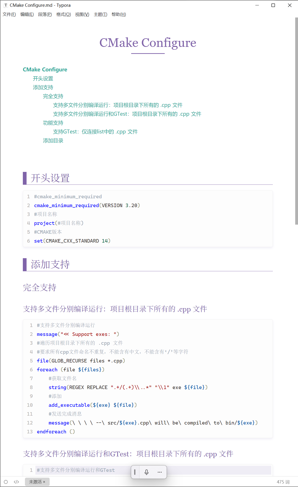
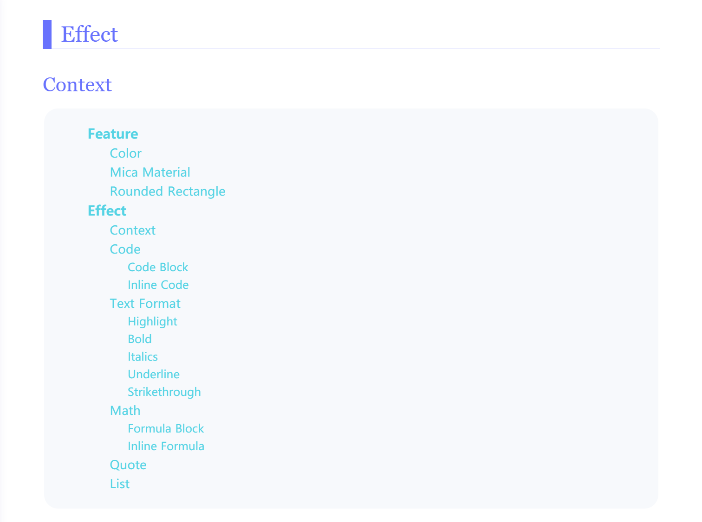
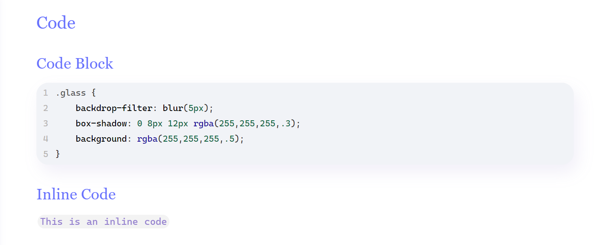
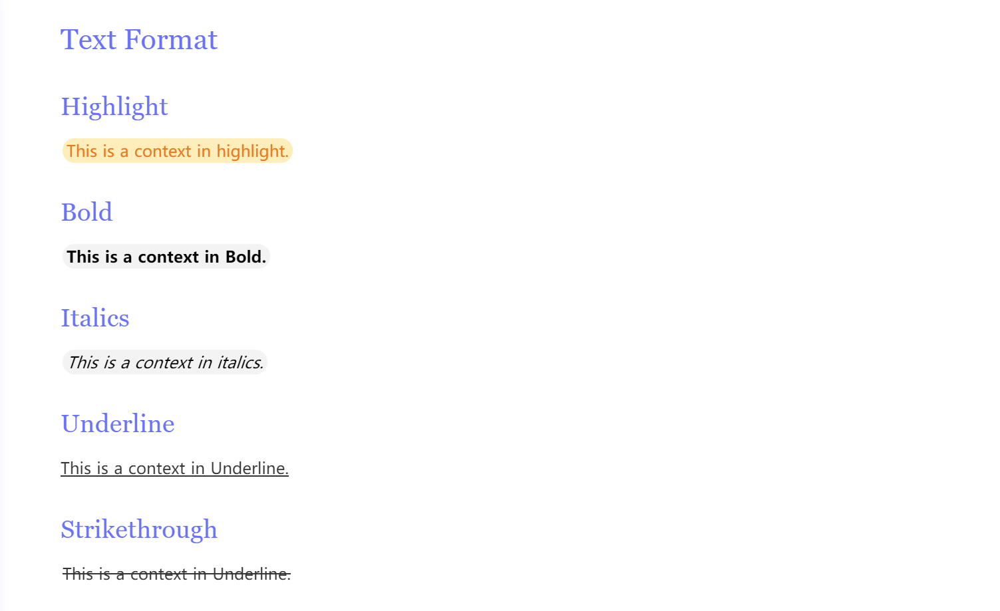

# Liquid

A nice theme for Typora, inspired by [Purple Theme](https://github.com/hliu202/typora-purple-theme) and [Microsoft Fluent Design](https://www.microsoft.com/design/fluent/#/). This theme provides outstanding visual effects design for Windows 11.

> This theme has been tested on Windows 11 and Windows 10.

